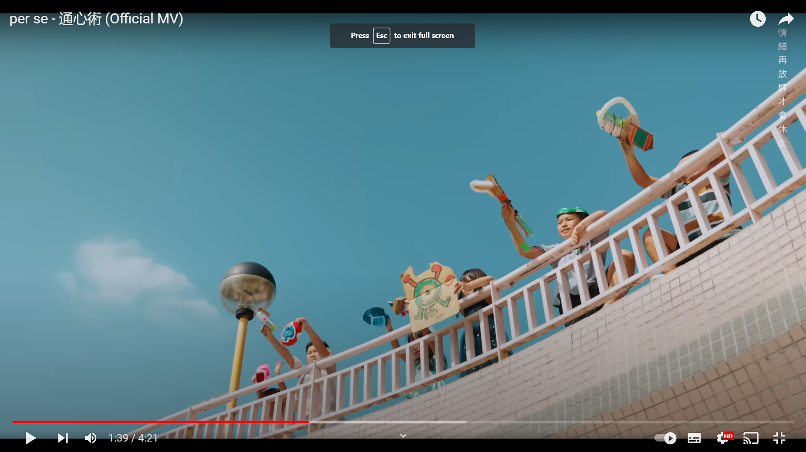
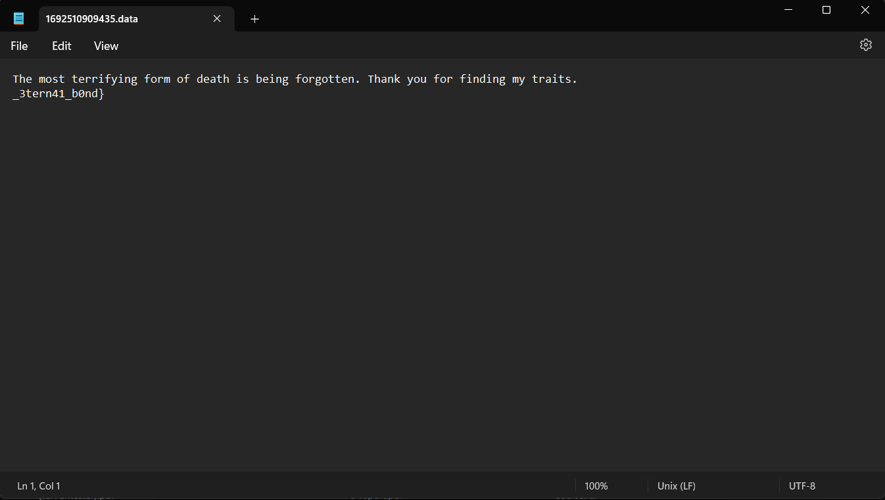

Hello, this is some lines for this Black Bauhinia 2023 contest. First, Im extremely hype because me with my bro  `@giappppp`  in  `phis1Ng__` had come third in solving a Misc challenge, and because of its 500 points, it made us to the top 19. That challenge was interesting so I will write some for it :D

Im responsible for 2 areas in my team: Misc and Rev(but sadly Rev is only done after the contest, I didnt manage to complete them), and that's all, here we go :D

# MISC
## 1. Telepathy

    
        

            <b> Description</b>
        

        

            <a href="https://www.youtube.com/watch?v=AsmxdD7DNKU">https://www.youtube.com/watch?v=AsmxdD7DNKU</a> 
             
            10 years ago, it was prophesied that the Earth is going to end soon. Some people then had chosen to move to Mars. Today, you on Earth, have received an image sent from Mars, what are they trying to tell? How are they? 
             
            Attachment: <a href="https://ctf.b6a.black/files/the_forgiven_78b1fd9d24b374e5671be61f8ca610cc.jpg">the forgiven.jpg</a> 
             
            Note: The regex of any password in this challenge (if you ever need one) is <code>[a-z ]+</code>. 
             
            Hint (released 2023.08.20 11:30; or +27h 30m): 
            The steganographic algorithm used is NOT a common method appearing on Aperi'Solve 😃 
             
            Remarks: 
             
            1. This algorithm is only available for JPEG images 
            2. The password does not need to be bruteforced 
            3. This algorithm is a successor of <a href="https://youtu.be/ocTdA8NytIc">https://youtu.be/ocTdA8NytIc</a>. What do you do to refresh? 
            4. This challenge may be the only challenge that the song selected is related to the challenge per se.  
           5.  Make sure you also check the song if you need to OSINT. 
           6.  The length of the password is 12 
           7.  The implementation of the algorithm matters 
        

        

        

    

When I started to do, the chall just gave me a youtube link (attention heree!), a pic and a note about regex. I thought a youtube link is just bullshit and has no meaning so I ignore it real soon ( I was wrong:)) ). Move over to the pic, it is just an ultra dark pic with a part of the flag: 

I edited it a bit so we can see more clearly:

So, that's all I could do :D I even tried to edit it with different ways but I still cant see anything. At first, I was kinda stuck at this challenge and had no idea for it until the author gave some clues :D Let's check them out !! So, this is a stega challenge, cuz it had said that there was a difference in normal stega method and using Aperi Solve would have no effect :D

The first and the second hint guided us to the fact that if we intend to osint, just osint the one algorithm for JPEG and furthermore, the password is only in this website.

Then we came to the third hint, which is one of the most important one:

It said the algo is a successor of this, but I couldnt see anything that can have its successor. I even watched the whole clip but still cant see anything sus. But then, I look to the author, it said the author is F4, combining to the line `"refresh and ..."` in the pic, I immediately see the algorithm must be F5 :D 

How interesting it is ! After some googling, there is even an algo called `" F5 steganographic algorithm "`, at this time, I know 100% that Im on the right track and I need to find an online decoder or sth, because the implementation is nearly impossible due to the short amount of time. And indeed, it is one of the hardest part to do.

After a while, thiss was freaking awsome, `@giappppp` found an online one for it after reading some writeups online. The writeup is https://kishanbagaria.com/bountycon/ and the web page for the decoder is http://desudesutalk.github.io/f5stegojs/ :

So we can see it required a password, the cover image is indeed that dark one, so we need to find the password.

Coming back to the password, I think I need to analyze the video a little bit. Having watched it a little bit, I saw one frame that is the given picture: 

So now the password wouldnt be far. I analyze the song's name in English and it is `the forgiven` and how wonderful it is, it has the same length as the sixth hint said. I tested it and the output returned a `.data` file: 

Open that, we have the remaining part:

At the time I finished, I thought I came second in solving the challenge ( haha to be honest Im extremely hype and proud of myself about it ) but because of my stupidness, I had to wait another 30s to re-submit and came third uwu. Such some sweet points and feelings with lads and so proud of my team :D

To me, it is real fun to do and analyze with friend tho, really appreciate bro `@giappppp` for the tool, love u sooo.

> flag: b6actf{3ph3m3r41_m1nd_3tern41_b0nd}

