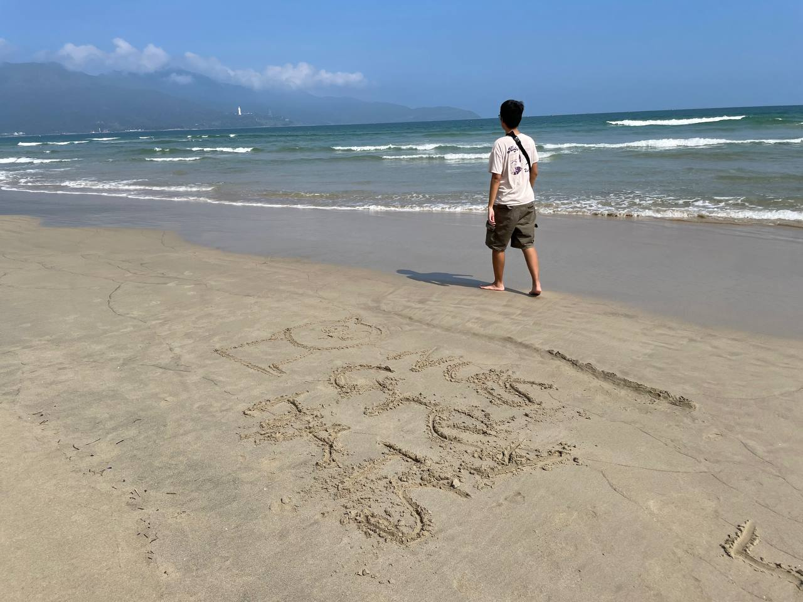

Hello, still me again :) this is my writeup for GreyCTF Quals 2024. To be honest, its not that hard and glorious to even pull a writeup for this, but to me, this is the last time i play with my team that have been with me over last 2 years and maybe, it's also the last official ctf contest for me cuz now i have no team (still play but just on platform in order to study), so i will call this the last dance :) Therefore, I want to leave something as a farewell for this 2-year wonderful adventure. Hope my team will achieve what they want and deserve to have and I can have what i want in the future, now just head back to work ~~

 Anyway, this time, i almost made it through those Misc challenges, but because i was so busy in Swiss while the contest was hosting, I couldnt manage to clear and brought shame to our team; moreover I also cleared the mini games challenges :) 

# Misc
## 1. Sanity Check

    
        

            <b> Description</b>
        

        

I lost my grey cat when we were overseas.  This is the last picture I found of it, but I have no idea where it is. Can you help me identify this beach?
 
The flag format is grey{name_of_beach_in_lower_case}.
 There is no word "beach" in the flag.
 

They give us an image look like this:

Kinda easy for me because im a Vietnamese and have just visted this 3 months ago :))) It is a beach in Da Nang, but not that one it should have been -_- the right one should be Mỹ Khê beach instead of the flag.

As u can see, there is a white dot in the far left of the beach on the mountain, that is a buddha statue in a pagoda, and the mountain it located on is Sơn Trà Peninsula. Using GG Lens for searching, u will soon find out where it is because this is one of the most famous beach cities in the world :D

> flag: grey{pham_van_dong}

## 2. Cats at the beach

## 3. Grey Divers

## 4. All about timing

## 5. Poly playground

## 6. Cashhat The Ripper

## 7. Out in Plain sight

# Greycat's Adventure

## 1. Timelock

## 2. Vault

## 3. Achievement 1

## 4. Achievement 2

## 5. Achevement 3