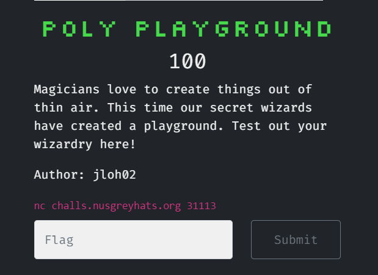

Hello, still me again :) this is my writeup for GreyCTF Quals 2024. To be honest, its not that hard and glorious to even pull a writeup for this, but to me, this is the last time i play with my team that have been with me over last 2 years and maybe, it's also the last official ctf contest for me cuz now i have no team (still play but just on platform in order to study), so i will call this the last dance :) Therefore, I want to leave something as a farewell for this 2-year wonderful adventure. Hope my team will achieve what they want and deserve to.

 Anyway, this time, i almost made it through those Misc challenges, but because i was so busy in Swiss while the contest was being hosted, I couldnt manage to clear and brought shame to our team. In this writeup, I would give writeups to those I did and didnt manage to solve on time(after contest) :) 

# Misc
## 1. Sanity Check


>flag: grey{w3lc0m3_to_gctf2024_enjoy_your_stay!} 
## 2. Cats at the beach


They give us an image look like this:


Kinda easy for me because im a Vietnamese and have just visted this 3 months ago :))) It is a beach in Da Nang, but not that one it should have been -_- the right one should be Mỹ Khê beach instead of the flag.

As u can see, there is a white dot in the far left of the beach on the mountain, that is a buddha statue in a pagoda, and the mountain it located on is Sơn Trà Peninsula. Using GG Lens for searching, u will soon find out where it is because this is one of the most famous beach cities in the world :D

> flag: grey{pham_van_dong}

## 3. Grey Divers

So the image is something looks like a table game:

So we have gut instinct telling that by some mean, we havve to connect all of those letters to have the flag. And by doing some researchs, this is related to HellDivers 2 game and the given note is about some special skills or equipments can be achieved after doing several moves. For example, the moves are:


 Yes, the moves, they are the key for solving this, by doing one by one, we have a route:

>flag: grey{i3mm_e1w3st_2_n3oU10o3E!}

## 4. All about timing

After nc, we have this:

Looking at the code, we also have:
```py
import time
import random

random.seed(int(time.time()))

print("Guess the number I'm thinking of? It's all about the timing")
x = input("Your guess:")

n = random.randint(1000000000000000, 10000000000000000-1)

if int(x) == n:
    with open("flag.txt") as f:
        print(f.readline())
else: 
    print(f"Wrong answer! The number I was thinking of was {n}\nRemember it's all about the timing!")
```
So this is random number using the seed is your current exactly time, we just need to write a small script doing this:
```py
from pwn import *
import time
import random

# Define the server address and port
target = remote('challs.nusgreyhats.org', 31111)

#target = process(["python3", "test.py"])
random.seed(int(time.time()))
n = random.randint(1000000000000000, 10000000000000000-1)
target.sendlineafter(b"Your guess:", (str(n).encode()))
target.interactive()
```

> flag: grey{t1m3_i5_a_s0c1al_coNstRucT}
## 5. Poly playground

After connecting, we are told to do as below for 100 times:

Has been being stupid in Math, I didnt know what to do till my teammate @Giapppp sent me a docs about implantation of generating coefficient in python [here](https://numpy.org/doc/stable/reference/generated/numpy.poly.html), and here is my script to automate that process:
```py
import numpy as np
from pwn import *
target = remote('challs.nusgreyhats.org', 31113)s
for _ in range(100):
    received_data = target.recvuntil(b"\nRoots: ")
    print("Received:", received_data.decode())
    roots_str = target.recvline().decode()
    roots = list(map(float, roots_str.split(',')))
    coefficients = np.poly(roots)
    coefficients_int = [int(coefficient) for coefficient in coefficients]
    coefficients_str = ','.join(map(str, coefficients_int))
    print("Sending:", coefficients_str)
    target.sendlineafter(b"Present the coefficients of your amazing equation:", coefficients_str.encode())
target.interactive()
```

>flag: grey{l0oks_lik3_sOm3one_c4n_b3_a_po1ynomia1_w1z4rd}
## 6. Cashhat The Ripper

They give us a zip file and there is a flag stored in that, by seeing the solves, this is such a easy one using tools online, for instance, from the problem's name, we can think of Hashcat or John the Ripper (I didnt use this but it was on my list while I was looking for a way to solve). This time my teammate ```dcduc``` use ```fcrackzip``` with infamous ```rockyou.txt```:

With the password found, we unlock the file:

> flag: grey{W34k_P4ssw0rds_St4Nd_n0_Ch4nc3}
## 7. Out in Plain sight


Looking at the ```@``` provided, we immediately think of Instagram :). Heading there and the only sus thing we find is the reels published there. Watched it carefully and we will have:

Actually, the given hash is for the reason that there are many fake flags and we will use the hash to identify which is the real one.
>flag: grey{y0uR_eYeS_aRe_5hArP}
# Greycat's Adventure

## 1. Timelock

## 2. Vault

## 3. Achievement 1

## 4. Achievement 2

## 5. Achevement 3