Hello, this is my Misc Writeups for ISITDTU Quals 2023. I have been waited for it since last year, but sadly, I was responsible for `Reverse` and `Misc` and I couldnt clear any of these 2 sections :< and this is the first time I played with a new team ( my brother's team ), so it was kinda interesting to talk about. Now, let's get started !!

# MISC
## 1. welcome
<div class="warning" style="padding:0.1em; background-color:#1A1F35;">
    <span>
        <p style="margin-top:1em; text-align:center;">
            <b><span style="color:#FFFFFF !important;"> Description</span></b>
        </p>
        <p style="margin-left:1em; color:#FFFFFF;">
8Q/2[6r[05G@bT,@o$rQ?Z[u/8Q0>FA9;s$@ru=2
<br>
            
</div>    
    
Used [cypher detect](https://www.dcode.fr/cipher-identifier) to find out which kind of encoding was, I saw that it used `ASCII-85` to encrypt the flag, now we just simply decode it and get the flag
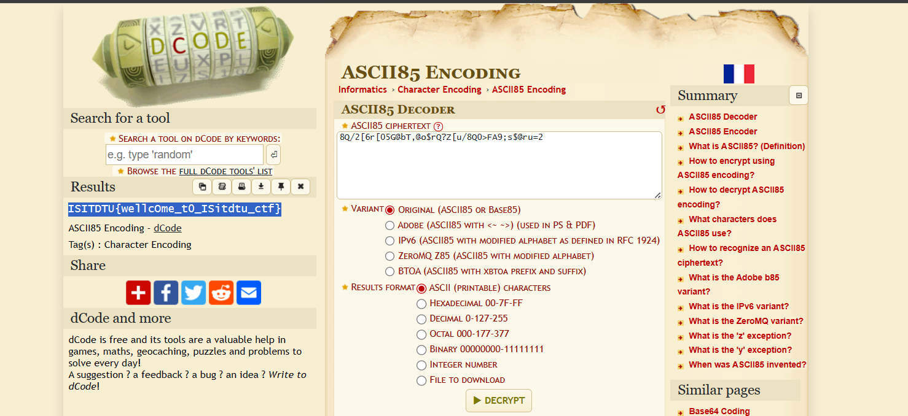
>flag: ISITDTU{wellcOme_t0_ISitdtu_ctf}
    
    
## 2. traffic

<div class="warning" style="padding:0.1em; background-color:#1A1F35;">
    <span>
        <p style="margin-top:1em; text-align:center;">
            <b><span style="color:#FFFFFF !important;"> Description</span></b>
        </p>
        <p style="margin-left:1em; color:#FFFFFF;">
I found a strange process on my computer trying to connect to the internet, can you tell me what it sends?
<br>
            <br>
Attachment: <a href="https://ctf.isitdtu.com/files/30c43f36255ce01b017d0670fb5bcf17/traffic.pcap?token=eyJ1c2VyX2lkIjoxMzAwLCJ0ZWFtX2lkIjo4NzksImZpbGVfaWQiOjI0fQ.ZS9FwA.kvYHcUGJxMpfc-iqQkPPXdH3cNY">traffic.pcap</a><br><br>
</div>    

Opened it with wireshark and exported the object in HTTP to see files sent and received, I saw that one sussy file here:

After downloaded, I opened the file and had this:
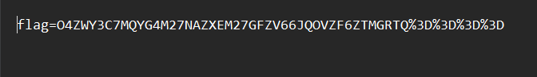
Looked like it was encrypted by something, but first we could see that`%3D` sussy in the end. Doing some research we would know that it is `URL encoding` and those`%3D` was just `=` symbol.
    
Fixing a little bit and we will have:
    ```O4ZWY3C7MQYG4M27NAZXEM27GFZV66JQOVZF6ZTMGRTQ====```
    
 now it looked like baseN encrypting, trying will multiple encrypting way and we see that it was Base32:
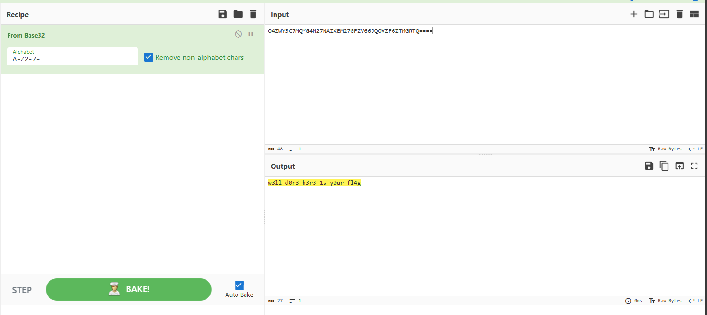
    
>flag: ISITDTU{w3ll_d0n3_h3r3_1s_y0ur_fl4g}

## 3. Famous girl

<div class="warning" style="padding:0.1em; background-color:#1A1F35;">
    <span>
        <p style="margin-top:1em; text-align:center;">
            <b><span style="color:#FFFFFF !important;"> Description</span></b>
        </p>
        <p style="margin-left:1em; color:#FFFFFF;">
            Cithrel Wynhice, a captivating social media influencer known for her beauty and wanderlust, had embarked on a journey to explore the enchanting landscapes of China. Her followers eagerly awaited her posts, hungry for the next breathtaking photo or exciting adventure. However, what started as a picturesque exploration soon turned into an unexpected mystery.
<br>
            <br>
Format flag: ISITDTU{f4k3_fL49}<br>
</div>     
    
At first, at any other challenges, I started at twitter but couldnt find anything helpful, so I headed to Insta and I had this:
    
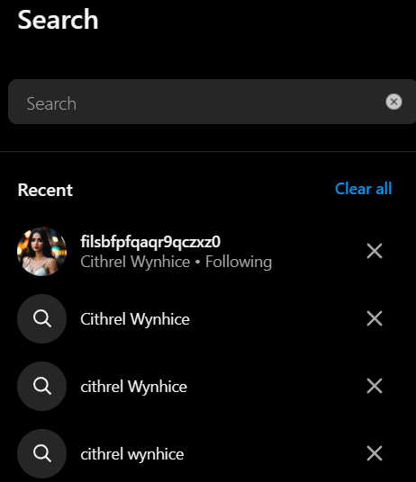

U will soon find her name was sth like caesar cipher and there was a binary string, but dont be hype soon, that was just author's joke.

Now it was a bit, kinda guessy that, u will need to direct to Threads if u want to continue the game. Fortunately, it is accompanied with Insta so just use the old username and we can find the account. On Threads, u can find a binary string too on her bio, decode it and we have:
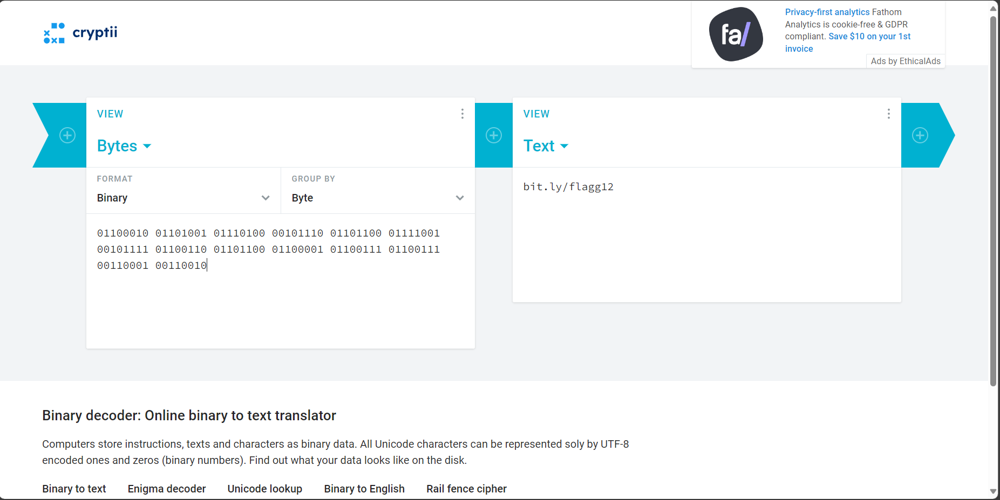

This time, it provided us with a link. Access it we will have:
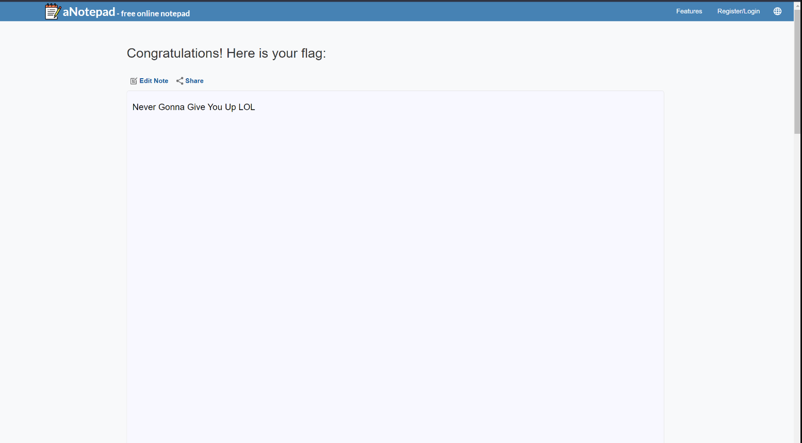

One more time we will have something looked like troll, but dont be angry, it was the flag and can u see, it is kinda weird because it has long innecessary space, we might see it related to ```white space encoding```, using some online tools and we will have: 

> flag: ISITDTU{4_n3w_w4Y_t0_5hAr3_wjtH_t3xt}

    
 ## 4. Discover

<div class="warning" style="padding:0.1em; background-color:#1A1F35;">
    <span>
        <p style="margin-top:1em; text-align:center;">
            <b><span style="color:#FFFFFF !important;"> Description</span></b>
        </p>
        <p style="margin-left:1em; color:#FFFFFF;">
            During her trip to China, Cithrel Wynhice posted a flycam-captured photo on her social media and challenged her fans to locate the exact spot in the picture and tell her the name of the tall building across from it.
<br>
            <br>
Format flag: ISITDTU{danang_azura_apartment}<br>
</div>          
    
    
Yes, its time to geosint a little bit now, lets dig deeper her Threads account. Scroll down more and u will see this:


The random number string reminded me to the url of a post, and by using the formula: 

```https://facebook.com/[random string here]```
```https://twitter.com/username/status/[random string here]```

U will see the facebook was one more troll, but not the twitter one.
[alt text](image-10.png)
It is linktree, a tool to manage accounts. Downloading the image on twitter and use [Aperi Solve](https://www.aperisolve.fr/), u will have her linktree account through exiftools: https://linktr.ee/cithrelwynhice. But we will have nothing related to this challenge but the next challenge. Now it seems to hard, so by googling popular social media platforms, i found Mastodon (tooo guessy)

Accesss to her Mastodon account, we will have this:
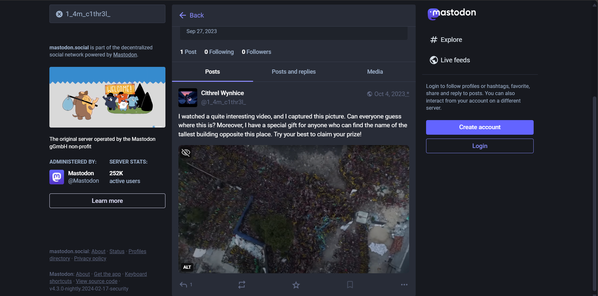

Using GG image find and knowing her watching this on a video, we will soon find it on youtube with this link:
 https://www.youtube.com/watch?v=TDfLWFv3ixk

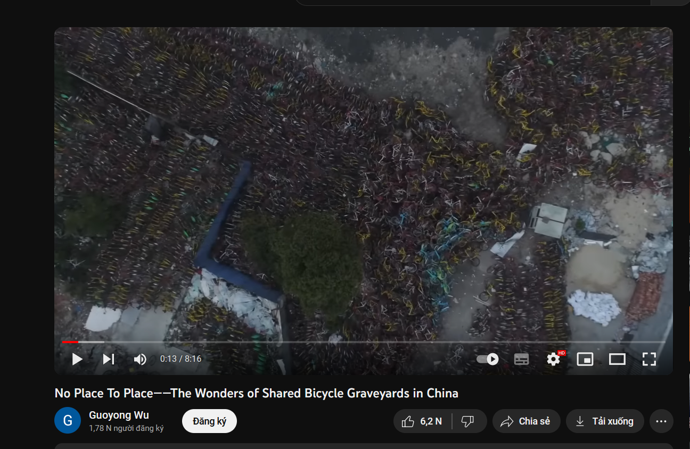

Watching the video, u will find this
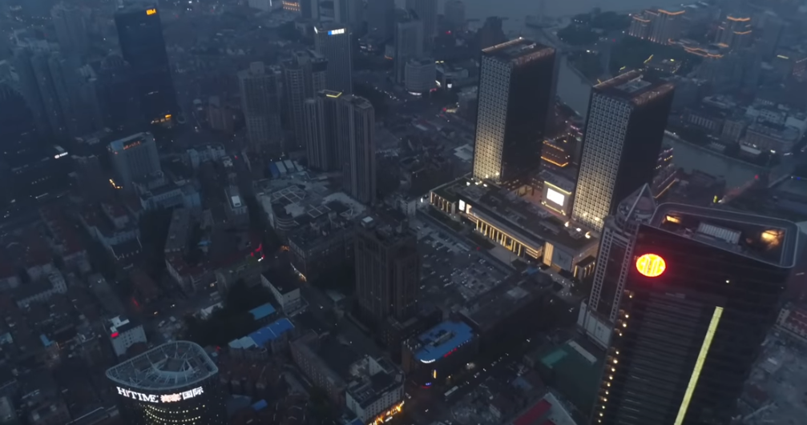

And this is the one we need to find:


By doing some googling its name HITIME, we will know the address and remember to use ```baidu map``` for the full addresss for the tallest building
> flag: ISITDTU{shanghai_citic_plaza}

## 5. Communication

<div class="warning" style="padding:0.1em; background-color:#1A1F35;">
    <span>
        <p style="margin-top:1em; text-align:center;">
            <b><span style="color:#FFFFFF !important;"> Description</span></b>
        </p>
        <p style="margin-left:1em; color:#FFFFFF;">
            It seems like Cythrel Wyhnice wants to have a place to socialize with her fans.
<br>
            <br>
Format flag: ISITDTU{f4k3_fl4g}<br>
</div>   

Remember her linktree account? We had a Discord server and a video, ignore that video, u see that there are a secret channel containinng too many flag links. It is okay to bruteforce but there was another way. This time, we are out of ways, so 1 more (guessy af) way is to use ```wayback machine``` with the twitter post and u will find this: 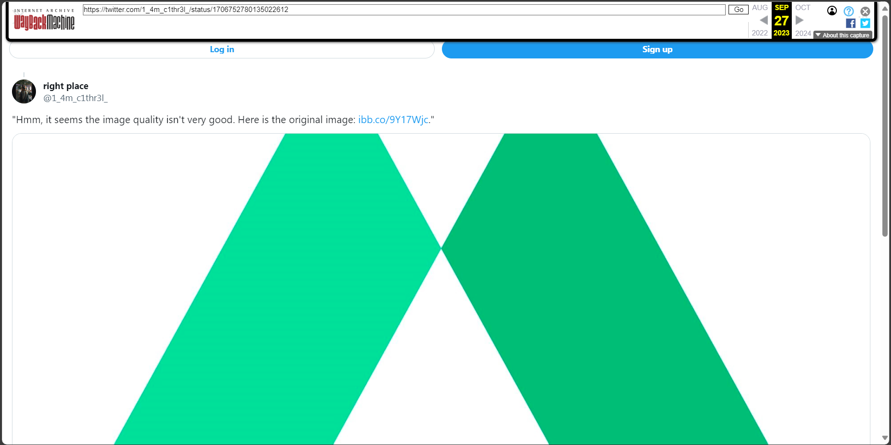

Click on her account, and use the arrow on the top right of the screen that we can see older version of the profile: 

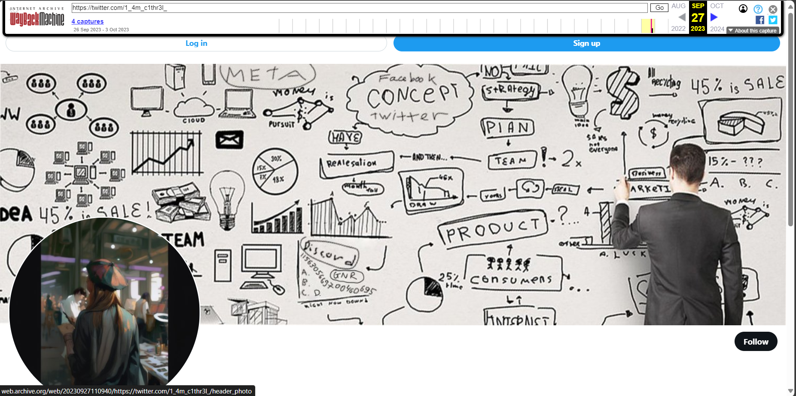

See that random string, combine with the discord, we might think to the message url. 
https://discord.com/channels/1154636986448085032/1154669336645083166/1156305669700460695

Click and we will have:


Using ```Xiao Steganography``` to extract the xls file from that. And open the file we will have:
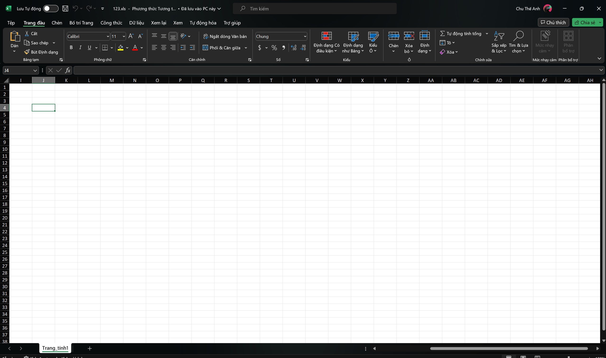

Select all and press ```Ctrl + Shift + ~``` u will get the flag:

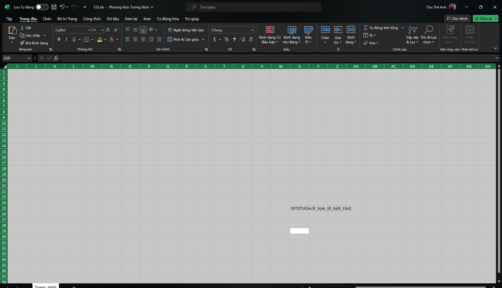

Been saying that, after the context, i learnt there was another method. That is to ```use zsteg -a flag.bmp``` and u will find something unusual: "TAG:Int21" Next, use the command: ```zsteg -E b1,lsb,bY flag.bmp > data_file``` to extract the data to a file named "data_file." Open "data_file" with Excel and search for "ISITDTU" to find the flag too. I stil dont really understand this way :)

> flag: ISITDTU{3xc3l_trjck_t0_hjd3_t3xt}