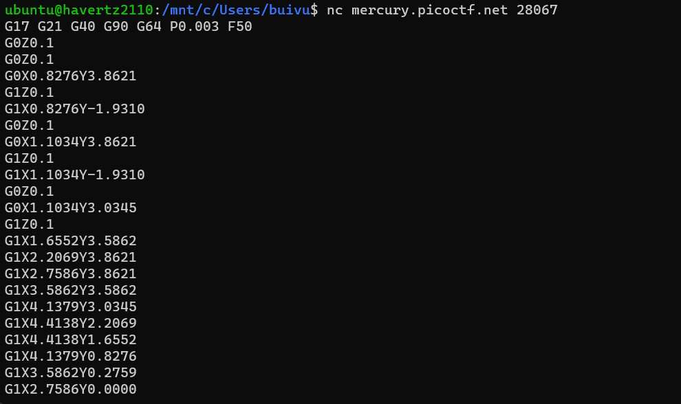
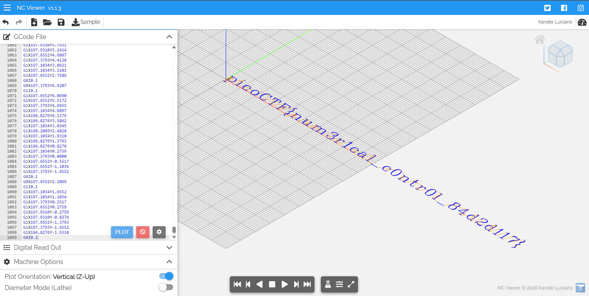
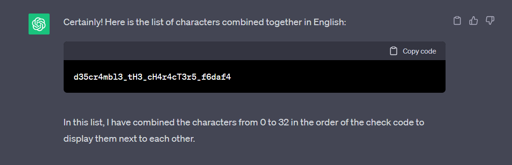
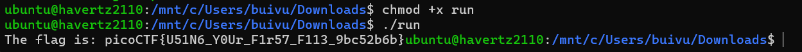
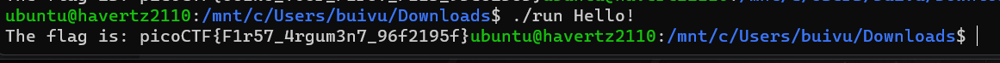
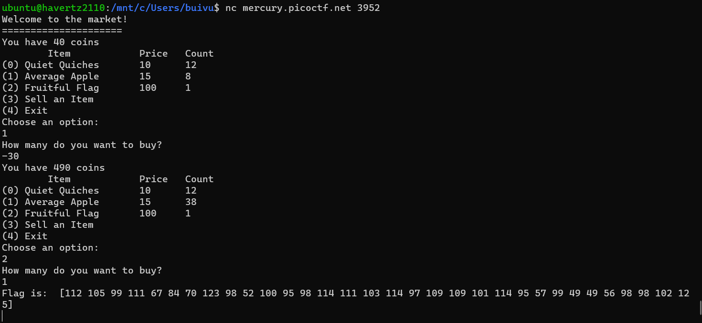

Here are all the challenges I have done in order to improve my skills ( still updating :D )

## 1. Transformation - 20pts

<div class="warning" style="padding:0.1em; background-color:#1A1F35;">
    <span>
        <p style="margin-top:1em; text-align:center;">
            <b><span style="color:#FFFFFF !important;"> Description</span></b>
        </p>
        <p style="margin-left:1em; color:#FFFFFF;">
            I wonder what this really is... <a href="https://mercury.picoctf.net/static/dd6004f51362ff76f98cb8c699510f23/enc">enc</a>
            ''.join([chr((ord(flag[i]) << 8) + ord(flag[i + 1])) for i in range(0, len(flag), 2)])
        </p>
        <p style="margin-bottom:1em; margin-right:1em; text-align:right; font-family:Georgia; color:#FFFFFF;">
        </p>
    </span>
</div>


                

First, we open the file with any text editor and go to the hex window, we will have this: `灩捯䍔䙻ㄶ形楴獟楮獴㌴摟潦弸弰摤捤㤷慽`.Yes, there are just some random Chinese and there are nothing special further.

Next, look at the description one more closely:
```python=
''.join([chr((ord(flag[i]) << 8) + ord(flag[i + 1])) for i in range(0, len(flag), 2)])
```
We will analyze this a bit deeper:

`for i in range(0, len(flag), 2)`: This loop loops through the "flag" string within taking 2 digits per time

`ord(flag[i])`:  ord() returns the Unicode value of the input digit. In this case, it takes the digit at order "i" is "f" in string "flag".

``(ord(flag[i]) << 8) + ord(flag[i + 1])``: combines the Unicode code points of two characters into an integer by left-shifting the Unicode code point of the first character by 8 bits and then + the Unicode code point of the second character.

``chr(...)``: It is the opposite of ord(), changing a decimal to its respective Unicode value. 

``''.join(...)``: Finally, we connect the calculated digits into a new string.

A small example of how it works:
```
28777 = ord(flag[0]) << 8 + ord(flag[1])

ord('p') <<8 + ord('i')
= 112 << 8 + 105
= 28672 + 105 
= 288777
```

So now, the problem is to find some numbers so we can turn them back to the flag. Now remember those random chinese words above, we will try to turn them back into numbers and we have: `28777, 25455, 17236, 18043, 12598, 24418, 26996, 29535, 26990, 29556, 13108, 25695, 28518, 24376, 24368, 25700, 25444, 14647, 24957`

Now, just write a simple code to do the rest:
```python=
numbers = [28777, 25455, 17236, 18043, 12598, 24418, 26996, 29535, 26990, 29556, 13108, 25695, 28518, 24376, 24368, 25700, 25444, 14647, 24957]


result_chars = []


for num in numbers:
    
    char1 = chr((num >> 8) & 0xFF)  
    char2 = chr(num & 0xFF)         

    
    result_chars.extend([char1, char2])


flag = ''.join(result_chars)
print(flag)
```
> flag: picoCTF{16_bits_inst34d_of_8_0ddcd97a}

p/s: im still figuring out why with each player, it has a different flag's tail 


## 2. keygenme-py

<div class="warning" style="padding:0.1em; background-color:#1A1F35;">
    <span>
        <p style="margin-top:1em; text-align:center;">
            <b><span style="color:#FFFFFF !important;"> Description</span></b>
        </p>
        <p style="margin-left:1em; color:#FFFFFF;">
            <a href="https://mercury.picoctf.net/static/0c363291c47477642c72630d68936e50/keygenme-trial.py">keygenme-trial.py</a>.
        </p>
        <p style="margin-bottom:1em; margin-right:1em; text-align:right; font-family:Georgia; color:#FFFFFF;">
        </p>
    </span>
</div>


It just gives us a python file, so, let's open it and analyze some important functions: 

```python=
username_trial = "MORTON"
bUsername_trial = b"MORTON"

key_part_static1_trial = "picoCTF{1n_7h3_|<3y_of_"
key_part_dynamic1_trial = "xxxxxxxx"
key_part_static2_trial = "}"
key_full_template_trial = key_part_static1_trial + key_part_dynamic1_trial + key_part_static2_trial

```

So we can see the flag is combined from 3 parts: 
`key_part_static1_trial` (picoCTF{1n_7h3_|<3y_of_)
`key_part_dynamic1_trial`(xxxxxxxx) 
`key_part_static2_trial`(})
```python=
def enter_license():
    user_key = input("\nEnter your license key: ")
    user_key = user_key.strip()

    global bUsername_trial
    
    if check_key(user_key, bUsername_trial):
        decrypt_full_version(user_key)
```
Then, we move into the `enterlicense()` function. It uses the `check_key()` function to check between the input (user_input) and bUsername_trial, and if it is right, we would go to `decrypt_full_version(user_key)`.

So, we need to check the `check_key()` function to see how it works.
```python=
if len(key) != len(key_full_template_trial):
        return False
```
so if we can see, the `key`'s length is the same with `key_full_template_trial`'s length, and if they are the same length, it starts to check the key if it is legit or not.

First, it checks the key's static part by comparing each character of the key with each character of key_part_static1_trial. 
```python=
i = 0
        for c in key_part_static1_trial:
            if key[i] != c:
                return False

            i += 1
```
Secondly, it checks the dynamic part:
```python=
if key[i] != hashlib.sha256(username_trial).hexdigest()[4]:
            return False
        else:
            i += 1

        if key[i] != hashlib.sha256(username_trial).hexdigest()[5]:
            return False
        else:
            i += 1

        if key[i] != hashlib.sha256(username_trial).hexdigest()[3]:
            return False
        else:
            i += 1

        if key[i] != hashlib.sha256(username_trial).hexdigest()[6]:
            return False
        else:
            i += 1

        if key[i] != hashlib.sha256(username_trial).hexdigest()[2]:
            return False
        else:
            i += 1

        if key[i] != hashlib.sha256(username_trial).hexdigest()[7]:
            return False
        else:
            i += 1

        if key[i] != hashlib.sha256(username_trial).hexdigest()[1]:
            return False
        else:
            i += 1

        if key[i] != hashlib.sha256(username_trial).hexdigest()[8]:
            return False
```

So it checks each character of the key with the corresponding character of `username_trial` after hashing, if true, it goes to the next character. And now we understand how it works, so we can write a small script to recreate the key with the provided username_trial. 
```python=
import hashlib

def generate_key(username):
    key_part_static1_trial = "your_static_key_part_here"
    dynamic_part = [
        hashlib.sha256(username.encode()).hexdigest()[4],
        hashlib.sha256(username.encode()).hexdigest()[5],
        hashlib.sha256(username.encode()).hexdigest()[3],
        hashlib.sha256(username.encode()).hexdigest()[6],
        hashlib.sha256(username.encode()).hexdigest()[2],
        hashlib.sha256(username.encode()).hexdigest()[7],
        hashlib.sha256(username.encode()).hexdigest()[1],
        hashlib.sha256(username.encode()).hexdigest()[8]
    ]

    key_full_template_trial = key_part_static1_trial + ''.join(dynamic_part)
    return key_full_template_trial

# Test with the given username_trial "MORTON"
username_trial = "MORTON"
key = generate_key(username_trial)
print(key)
```
And here is the key: 75fc1081, so the flag is taken :D

> flag: picoCTF{1n_7h3_I<3y_of_75fc1081}
p/s: I is the `|` symbol, I dont know why I cant type it


## 3. droids3

<div class="warning" style="padding:0.1em; background-color:#1A1F35;">
    <span>
        <p style="margin-top:1em; text-align:center;">
            <b><span style="color:#FFFFFF !important;"> Description</span></b>
        </p>
        <p style="margin-left:1em; color:#FFFFFF;">
            Find the pass, get the flag. Check out this <a href="https://jupiter.challenges.picoctf.org/static/06318765139795831859f843dd56ce60/three.apk">file</a>.
        </p>
        <p style="margin-bottom:1em; margin-right:1em; text-align:right; font-family:Georgia; color:#FFFFFF;">
        </p>
    </span>
</div>

We use jadx to decompile the file, we can see class `FlagstaffHill` looks sus, so we will take a look at it.
```java=

public class FlagstaffHill {
    public static native String cilantro(String str);

    public static String nope(String input) {
        return "don't wanna";
    }

    public static String yep(String input) {
        return cilantro(input);
    }

    public static String getFlag(String input, Context ctx) {
        String flag = nope(input);
        return flag;
    }
```
We were right, there is a `getFlag()` function will return the flag for us. But unfortunately, it calls `nope()`, not `yep()` -  most likely to return the flag. 

So now, we will use apktool to decompile without resources ( because decompiling resources will cause build errors). Open cmd and run this:
```cmd=
apktool d three.apk --no-res
```


Now it will create a folder look like this in your corresponding directory:


Go to `three/smali/com/hellocmu/picoctf/FlagstaffHill.smali` and change this:
" `invoke-static {p0}, Lcom/hellocmu/picoctf/FlagstaffHill;->nope(Ljava/lang/String;)Ljava/lang/String;`"
to this: 
"`invoke-static {p0}, Lcom/hellocmu/picoctf/FlagstaffHill;->yep(Ljava/lang/String;)Ljava/lang/String;`"

Now, u can see that u have changed the called function (which would help returning flag).

Next, we will rebuild the app using this cmd:
```cmd=
apktool b three -o recompiled/recompiled_three.apk
```


Then, we sign it:
```cmd=
wget https://github.com/patrickfav/uber-apk-signer/releases/download/v1.1.0/uber-apk-signer-1.1.0.jar
java -jar uber-apk-signer-1.1.0.jar --apks recompiled
```
Use Android Studio to do the rest, now you start a new project and choose `File/Profile or Debug APK` and choose your `recompiled_three.apk` file. After that, run and type anything, it would return the flag:


flag: picoCTF{tis.but.a.scratch}

## 4. droids4

<div class="warning" style="padding:0.1em; background-color:#1A1F35;">
    <span>
        <p style="margin-top:1em; text-align:center;">
            <b><span style="color:#FFFFFF !important;"> Description</span></b>
        </p>
        <p style="margin-left:1em; color:#FFFFFF;">
            Reverse the pass, patch the file, get the flag. Check out this <a href="https://jupiter.challenges.picoctf.org/static/926d4bfd7030b13dbc98ca26e608c740/four.apk">file</a>.
        </p>
        <p style="margin-bottom:1em; margin-right:1em; text-align:right; font-family:Georgia; color:#FFFFFF;">
        </p>
    </span>
</div>

We use jadx to decompile the file, and we can see the `getFlag()` function is kinda lit. Here it is:
```java=
     public static String getFlag(String input, Context ctx) {
        StringBuilder ace = new StringBuilder("aaa");
        StringBuilder jack = new StringBuilder("aaa");
        StringBuilder queen = new StringBuilder("aaa");
        StringBuilder king = new StringBuilder("aaa");
        ace.setCharAt(0, (char) (ace.charAt(0) + 4));
        ace.setCharAt(1, (char) (ace.charAt(1) + 19));
        ace.setCharAt(2, (char) (ace.charAt(2) + 18));
        jack.setCharAt(0, (char) (jack.charAt(0) + 7));
        jack.setCharAt(1, (char) (jack.charAt(1) + 0));
        jack.setCharAt(2, (char) (jack.charAt(2) + 1));
        queen.setCharAt(0, (char) (queen.charAt(0) + 0));
        queen.setCharAt(1, (char) (queen.charAt(1) + 11));
        queen.setCharAt(2, (char) (queen.charAt(2) + 15));
        king.setCharAt(0, (char) (king.charAt(0) + 14));
        king.setCharAt(1, (char) (king.charAt(1) + 20));
        king.setCharAt(2, (char) (king.charAt(2) + 15));
        String password = "".concat(queen.toString()).concat(jack.toString()).concat(ace.toString()).concat(king.toString());
        return input.equals(password) ? "call it" : "NOPE";
    }
```
Use this exactly code and write another script.java to find the password:
```java=
class script {
    public static void main(String[] args) {
        StringBuilder ace = new StringBuilder("aaa");
        StringBuilder jack = new StringBuilder("aaa");
        StringBuilder queen = new StringBuilder("aaa");
        StringBuilder king = new StringBuilder("aaa");
        ace.setCharAt(0, (char) (ace.charAt(0) + 4));
        ace.setCharAt(1, (char) (ace.charAt(1) + 19));
        ace.setCharAt(2, (char) (ace.charAt(2) + 18));
        jack.setCharAt(0, (char) (jack.charAt(0) + 7));
        jack.setCharAt(1, (char) (jack.charAt(1) + 0));
        jack.setCharAt(2, (char) (jack.charAt(2) + 1));
        queen.setCharAt(0, (char) (queen.charAt(0) + 0));
        queen.setCharAt(1, (char) (queen.charAt(1) + 11));
        queen.setCharAt(2, (char) (queen.charAt(2) + 15));
        king.setCharAt(0, (char) (king.charAt(0) + 14));
        king.setCharAt(1, (char) (king.charAt(1) + 20));
        king.setCharAt(2, (char) (king.charAt(2) + 15));
        System.out.println("".concat(queen.toString()).concat(jack.toString()).concat(ace.toString()).concat(king.toString()));
    }
}
```
then you will see it prints `alphabetsoup` which is the password.

Next, do as the `droids3` challenge, decompile using `apktool d four.apk --no-res` and go to ``four/smali/com/hellocmu/picoctf/FlagstaffHill.smali`` and replace:
```java=
const-string v5, "call it"

return-object v5
```
with
```java=
invoke-static {p0}, Lcom/hellocmu/picoctf/FlagstaffHill;->cardamom(Ljava/lang/String;)Ljava/lang/String;

 move-result-object v0

 return-object v0
```

This change is to call the real function that gives the real flag. Yes, its motive is same to droids 3, so continue, we do as exactly what we have done before ( rebuild, sign and open using Android Studio). 

This time, the input is not random anymore, it is the password u found above, type it and u will get the flag.

> flag: picoCTF{not.particularly.silly}


## 5. Forky - 500pts

<div class="warning" style="padding: 0.1em; background-color: #1A1F35;">
    <span>
        <p style="margin-top: 1em; text-align: center;">
            <b><span style="color: #FFFFFF !important;"> Description</span></b>
        </p>
        <p style="margin-left: 1em; color: #FFFFFF;">
            In <a href="(https://jupiter.challenges.picoctf.org/static/7bd9504475583513cd7a9f72ee79b106/vuln)">this program</a>, identify the last integer value that is passed as a parameter to the function doNothing().
        </p>
        <p style="margin-bottom: 1em; margin-right: 1em; text-align: right; font-family: Georgia; color: #FFFFFF;">
        </p>
    </span>
</div>

So, using IDA to reverse the file, we look closely to these 2 functions:
`main()` function:
```=
; int __cdecl main(int argc, const char **argv, const char **envp)
public main
main proc near

prot= dword ptr -14h
flags= dword ptr -10h
var_C= dword ptr -0Ch
argc= dword ptr  8
argv= dword ptr  0Ch
envp= dword ptr  10h

; __unwind {
lea     ecx, [esp+4]
and     esp, 0FFFFFFF0h
push    dword ptr [ecx-4]
push    ebp
mov     ebp, esp
push    ebx
push    ecx
sub     esp, 10h
call    __x86_get_pc_thunk_bx
add     ebx, (offset _GLOBAL_OFFSET_TABLE_ - $)
mov     [ebp+prot], 3
mov     [ebp+flags], 21h ; '!'
sub     esp, 8
push    0               ; offset
push    0FFFFFFFFh      ; fd
push    [ebp+flags]     ; flags
push    [ebp+prot]      ; prot
push    4               ; len
push    0               ; addr
call    _mmap
add     esp, 20h
mov     [ebp+var_C], eax
mov     eax, [ebp+var_C]
mov     dword ptr [eax], 3B9ACA00h
call    _fork
call    _fork
call    _fork
call    _fork
mov     eax, [ebp+var_C]
mov     eax, [eax]
lea     edx, [eax+499602D2h]
mov     eax, [ebp+var_C]
mov     [eax], edx
mov     eax, [ebp+var_C]
mov     eax, [eax]
sub     esp, 0Ch
push    eax
call    doNothing
add     esp, 10h
mov     eax, 0
lea     esp, [ebp-8]
pop     ecx
pop     ebx
pop     ebp
lea     esp, [ecx-4]
retn
; } // starts at 566
main endp
```
It starts by allocating 4 bytes of memory using the mmap() function and sets the value at that memory location to 1000000000.

Then, it forks the process four times using the fork() function. This will create a total of 16 processes (including the original one) in a tree-like structure.

```cpp
*
|
|
|
*-------------------------------*                        	// fork first time, create a sub process and continue its own process --> 2 processes now
|                     		|	
|	              		|
|	             		|
*---------------*          	*--------------*         	// fork second time --> 4 processes
|          	|          	|              |      
|          	|          	|              |      
|          	|          	|              |      
*-------*    	*-------*       *-------*      *-------* 	// fork third time ---> 12 processes
|     	|     	|       |       |       |      |       |
|     	|	|   	|       |       |      |       |
| 	|     	|       |       |       |      |       |
*---*   *---*   *---*   *---*   *---*   *---*  *---*   *---* 	// fork fourth time --> 16 processes
|   |   |   |   |   |   |   |   |   |   |   |  |   |   |   |
|   |   |   |   |   |   |   |   |   |   |   |  |   |   |   |
|   |   |   |   |   |   |   |   |   |   |   |  |   |   |   |

```
Each process increments the value at the memory location by 0x499602d2.

After the forks, each process calls the doNothing() function with the value at the memory location as the parameter.

and `doNothing()` function:
```=
public doNothing
doNothing proc near

var_4= dword ptr -4
arg_0= dword ptr  8

; __unwind {
push    ebp
mov     ebp, esp
sub     esp, 10h
call    __x86_get_pc_thunk_ax
add     eax, (offset _GLOBAL_OFFSET_TABLE_ - $)
mov     eax, [ebp+arg_0]
mov     [ebp+var_4], eax
nop
leave
retn
; } // starts at 54D
doNothing endp
```
The reason behind this is the program keeps calling `doNothing()` function, so, we need to find last integer value that is passed as parameter to `doNothing()`. Because of starting with the value 1000000000, each process adds 0x499602d2 to the value before calling doNothing(). The forked processes run concurrently, and the order in which they execute is non-deterministic. Therefore, the value at the memory location will change unpredictably as the processes run in parallel.

Therefore, all we need to do is calculate 1000000000 + (16 * 0x499602d2). To do it, we use `python -c "from numpy import int32;print(int32(1000000000) + int32(16)*int32(0x499602d2))"` to get -721750240.

Here, we use the numpy.int32 datatype (generic unsigned integer) because the overflow just like in C

flag: picoCTF{-721750240}

## 6. Wizardlike - 500pts
p/s: now im too lazy to write the wus, see u soon
> flag: picoCTF{ur_4_w1z4rd_8F4B04AE}


## 7. crackme.py


<div class="warning" style="padding:0.1em; background-color:#1A1F35;">
    <span>
        <p style="margin-top:1em; text-align:center;">
            <b><span style="color:#FFFFFF !important;"> Description</span></b>
        </p>
        <p style="margin-left:1em; color:#FFFFFF;">
            <a href="https://mercury.picoctf.net/static/f440bf2510a28914afae2947749f2db0/crackme.py">crackme.py</a>
        </p>
        <p style="margin-bottom:1em; margin-right:1em; text-align:right; font-family:Georgia; color:#FFFFFF;">
        </p>
    </span>
</div>

Just use ROT47 to decode =))

>flag: picoCTF{1|\/|_4_p34|\|ut_8c551048}


## 8. vault-door-training

<div class="warning" style="padding:0.1em; background-color:#1A1F35;">
    <span>
        <p style="margin-top:1em; text-align:center;">
            <b><span style="color:#FFFFFF !important;"> Description</span></b>
        </p>
        <p style="margin-left:1em; color:#FFFFFF;">
              Your mission is to enter Dr. Evil's laboratory and retrieve the blueprints for his Doomsday Project. The laboratory is protected by a series of locked vault doors. Each door is controlled by a computer and requires a password to open. Unfortunately, our undercover agents have not been able to obtain the secret passwords for the vault doors, but one of our junior agents obtained the source code for each vault's computer! You will need to read the source code for each level to figure out what the password is for that vault door. As a warmup, we have created a replica vault in our training facility. The source code for the training vault is here: <a href="https://jupiter.challenges.picoctf.org/static/03c960ddcc761e6f7d1722d8e6212db3/VaultDoorTraining.java">VaultDoorTraining.java</a>
        </p>
        <p style="margin-bottom:1em; margin-right:1em; text-align:right; font-family:Georgia; color:#FFFFFF;">
        </p>
    </span>
</div>

just open the given file and copy the flag
>flag: picoCTF{w4rm1ng_Up_w1tH_jAv4_3808d338b46}


## 9. speeds and feeds
<div class="warning" style="padding:0.1em; background-color:#1A1F35;">
    <span>
         <p style="margin-top:1em; text-align:center;">
            <b><span style="color:#FFFFFF !important;"> Description</span></b>
        <p style="margin-left:1em; color:#FFFFFF;">
            There is something on my shop network running at <span style="color:red;">nc mercury.picoctf.net 28067</span>, but I can't tell what it is. Can you?
        </p>
        <details>
            <summary style="color:#FFFFFF;">Hint 1</summary>
            <p style="margin-left:1em; color:#FFFFFF;">What language does a CNC machine use?</p>
        </details>
        <p style="margin-bottom:1em; margin-right:1em; text-align:right; font-family:Georgia;">
        </p>
    </span>
</div>

So to me this is an easy challenge but the result is kinda fire, first connect to the server above we will have a bunch of weird codes(this is a part of it, u can see it urself when connet to it):


So now it's time to look at the hint, it said that it is related to the CNC machine, so we will do some google to find what code is used in it. After finding, we will realize that is ```G-code``` and as every ctf player will do, we will find an online tool to decode it, i found [one](https://ncviewer.com/). Copy all of those in the terminal and u will have this, kinda interesting isn't it?



>flag: picoCTF{num3r1cal_c0ntr0l_84d2d117}


## 10. vault-door-1

<div class="warning" style="padding:0.1em; background-color:#1A1F35;">
    <span>
         <p style="margin-top:1em; text-align:center;">
            <b><span style="color:#FFFFFF !important;"> Description</span></b>
        <p style="margin-left:1em; color:#FFFFFF;">
            This vault uses some complicated arrays! I hope you can make sense of it, special agent. The source code for this vault is here: <a href="https://jupiter.challenges.picoctf.org/static/87e103a8db01087de9ccf5a7a022ddf8/VaultDoor1.java">VaultDoor1.java </a>
        </p>
        <details>
            <summary style="color:#FFFFFF;">Hint 1</summary>
            <p style="margin-left:1em; color:#FFFFFF;">Look up the charAt() method online.</p>
        </details>
        <p style="margin-bottom:1em; margin-right:1em; text-align:right; font-family:Georgia;">
        </p>
    </span>
</div>

It is kinda easy, just ask chatgpt to place the character in ```public boolean checkPassword``` (it is the flag)  order for you:



>flag:  picoCTF{d35cr4mbl3_tH3_cH4r4cT3r5_f6daf4}

## 11. file-run1
<div class="warning" style="padding:0.1em; background-color:#1A1F35;">
    <span>
         <p style="margin-top:1em; text-align:center;">
            <b><span style="color:#FFFFFF !important;"> Description</span></b>
        <p style="margin-left:1em; color:#FFFFFF;">
            A program has been provided to you, what happens if you try to run it on the command line?
        <br>
            Download the program  <a href="https://artifacts.picoctf.net/c/218/run">here. </a>
        </p>
        <details>
            <summary style="color:#FFFFFF;">Hint 1</summary>
            <p style="margin-left:1em; color:#FFFFFF;">To run the program at all, you must make it executable (i.e. $ chmod +x run).</p>
        </details>
        <p style="margin-bottom:1em; margin-right:1em; text-align:right; font-family:Georgia;">
        </p>
        <details>
            <summary style="color:#FFFFFF;">Hint 2</summary>
            <p style="margin-left:1em; color:#FFFFFF;">Try running it by adding a '.' in front of the path to the file (i.e. $ ./run)</p>
        </details>
        <p style="margin-bottom:1em; margin-right:1em; text-align:right; font-family:Georgia;">
        </p>
    </span>
</div>

Just do exactly what the hints told us: 


>flag: picoCTF{U51N6_Y0Ur_F1r57_F113_9bc52b6b}

## 12. file-run2
<div class="warning" style="padding:0.1em; background-color:#1A1F35;">
    <span>
         <p style="margin-top:1em; text-align:center;">
            <b><span style="color:#FFFFFF !important;"> Description</span></b>
        <p style="margin-left:1em; color:#FFFFFF;">
            Another program, but this time, it seems to want some input. What happens if you try to run it on the command line with input "Hello!"?
        <br>
            Download the program  <a href="https://artifacts.picoctf.net/c/156/run">here. </a>
        </p>
        <details>
            <summary style="color:#FFFFFF;">Hint 1</summary>
            <p style="margin-left:1em; color:#FFFFFF;">Try running it and add the phrase "Hello!" with a space in front (i.e. "./run Hello!")</p>
        </details>
        <p style="margin-bottom:1em; margin-right:1em; text-align:right; font-family:Georgia;">
        </p>
    </span>
</div>


Do exactly as what the hint told u to (dont forget to ```chmod +x run```):


## 13. shop


