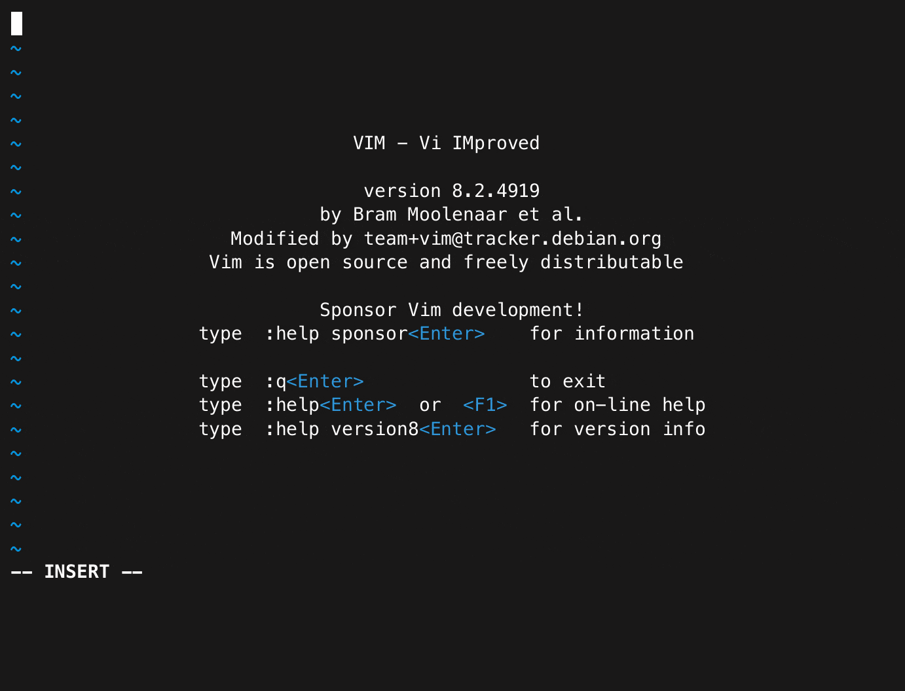
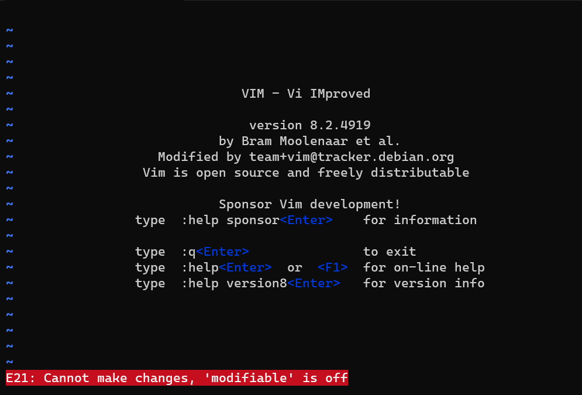
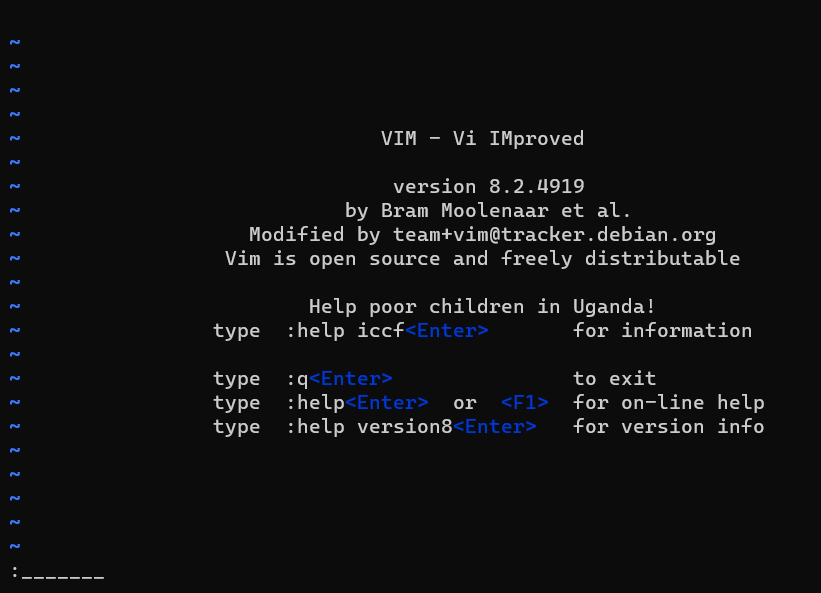
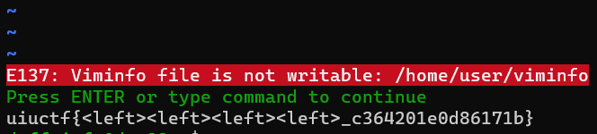
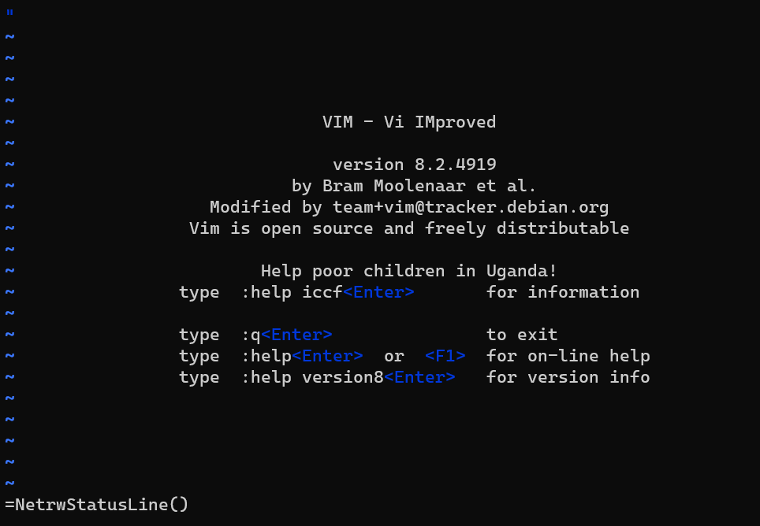
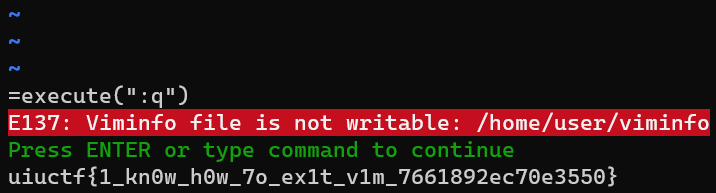
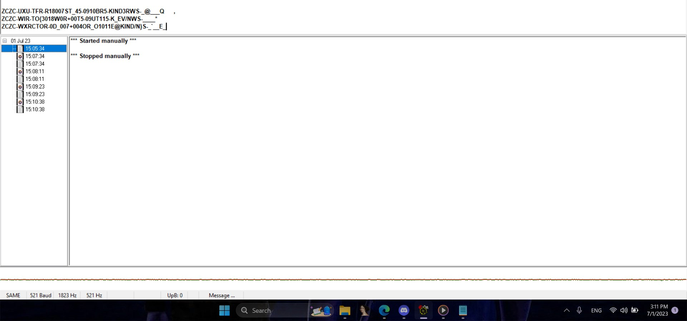

Hello, this is some lines for this UIUCTF 2023 contest. First, Im very happy because this is the first time I stepped into top 50 of an international contest with my team `phis1Ng__`, therefore, I think I need to write something in order to keep as a memory and to save some new ideas and techniques using this time.

Im responsible for 2 areas in my team: Misc and Osint(Rev is done after the contest), and that's all, here we go :D


# MISC
## 1. vimjail1

<div class="warning" style="padding:0.1em; background-color:#1A1F35;">
    <span>
        <p style="margin-top:1em; text-align:center;">
            <b><span style="color:#FFFFFF !important;"> Description</span></b>
        </p>
        <p style="margin-left:1em; color:#FFFFFF;">
            Connect with `socat file:$(tty),raw,echo=0 tcp:vimjail1.chal.uiuc.tf:1337`. You may need to install socat.
        </p>
        <p style="margin-bottom:1em; margin-right:1em; text-align:right; font-family:Georgia; color:#FFFFFF;">
        </p>
    </span>
</div>

**Provided files: [entry.sh](https://2023.uiuc.tf/files/9ab066e6d8dc34b582242cd0ee5b54b8/entry.sh) -- [nsjail.cgf](https://2023.uiuc.tf/files/55e629783aaddfeb0725477795ac4156/nsjail.cfg)-- [vimrc](https://2023.uiuc.tf/files/73a3a3658313279c33f2fc69b50c45cf/vimrc)**


At my first try, I saw 1 thing that if I connected to the server, I would be stuck at vim environment, therefore, I couldn't type anything I couldn't get out of this as a result. So, I think we have to find something in order to get out of this ( it would pop up a flag in the end, i guess?? :D )

Because of that, I looked up at the provided files, I checked at 'nsjail.cfg' but nothing looked sus in there, so I checked the rest ones. I soonly noticed in 'vim.rc' that are very cool :dagger_knife: :
```bash
set nocompatible
set insertmode

inoremap <c-o> nope
inoremap <c-l> nope
inoremap <c-z> nope
inoremap <c-\><c-n> nope
```
We can see that vim is in `insertmode` so we have to do sth to escape it. And those 'inoremap' give me an idea of combining keywords together so that we can escape :D.

After trying for a little bit with many different combinations, finally I figured out that the combination: `<c-\><c-o>` worked :D


> flag: uiuctf{n0_3sc4p3_f0r_y0u_8613a322d0eb0628}


## 2. vimjail1.5

<div class="warning" style="padding:0.1em; background-color:#1A1F35;">
    <span>
        <p style="margin-top:1em; text-align:center;">
            <b><span style="color:#FFFFFF !important;"> Description</span></b>
        </p>
        <p style="margin-left:1em; color:#FFFFFF;">
            Fixed unintended solve in vimjail1
        </p>
        <p style="margin-left:1em; color:#FFFFFF;">
            Connect with socat file:$(tty),raw,echo=0 tcp:vimjail1-5.chal.uiuc.tf:1337. You may need to install socat.
        </p>
        <p style="margin-bottom:1em; margin-right:1em; text-align:right; font-family:Georgia; color:#FFFFFF;">
        </p>
    </span>
</div>

**Provided files: [entry.sh](https://2023.uiuc.tf/files/55063dc423a8373f8cbc60d8aabd4ba6/entry.sh) -- [nsjail.cfg](https://2023.uiuc.tf/files/77ce241f2ff30c19cee849f65f2cf0dd/nsjail.cfg)-- [vimrc](https://2023.uiuc.tf/files/a5c49e80eb02414585d49a4815d2f004/vimrc)**

Looking at the `vimrc`, it just simply maps sth so I dont think use the normal way would help. I try a couple combination of `Ctrl` + sth, and `Ctrl + R=` works. I mean, this allows us to enter an expression, the result of which will be inserted to the file. It also allows entering keys and commands, as described by this example from this [link](https://vimhelp.org/insert.txt.html?#i_CTRL-R_=)

By doing that, we will use this:
```vim
"\<Esc>:e /flag.txt"
```
and get the flag as result

>flag: uiuctf{ctr1_r_1s_h4ndy_277d0fde079f49d2}

## 3. vimjail2

<div class="warning" style="padding:0.1em; background-color:#1A1F35;">
    <span>
        <p style="margin-top:1em; text-align:center;">
            <b><span style="color:#FFFFFF !important;"> Description</span></b>
        </p>
        <p style="margin-left:1em; color:#FFFFFF;">
            Fixed unintended solve in vimjail1
        </p>
        <p style="margin-left:1em; color:#FFFFFF;">
            Connect with socat file:$(tty),raw,echo=0 tcp:vimjail2.chal.uiuc.tf:1337. You may need to install socat.
        </p>
        <p style="margin-bottom:1em; margin-right:1em; text-align:right; font-family:Georgia; color:#FFFFFF;">
        </p>
    </span>
</div>


**Provided files: [entry.sh](https://2023.uiuc.tf/files/62b21acdeb6002bd9031cb569c43c8d4/entry.sh) -- [nsjail.cfg](https://2023.uiuc.tf/files/7787cd00e0f101d9680a52caee6b142a/nsjail.cfg)-- [vimrc](https://2023.uiuc.tf/files/35c5ace464a7bfa666295c14a2f8a9ed/vimrc) -- [viminfo](https://2023.uiuc.tf/files/bf3c336737319e16887d1b411234ae2f/viminfo)**

So this time, it is still the same with the ab0ve, we enter vim in insert mode and in order to obtain the flag, we have to escape. Let's take a look at `entry.sh` file:
```vim
#!/usr/bin/env sh

vim -R -M -Z -u /home/user/vimrc -i /home/user/viminfo

cat /flag.txt
```
So, it opens Vim in read mode only with modified option on and restricted mode active. It also uses a custom vimrc file located at `/home/user/vimrc` and uses `/home/user/viminfo` as the Viminfo file. And in the end it will print flag.txt file. Now, let's have a walkthrough in `vimrc`:
```vim
set nocompatible
set insertmode

inoremap <c-o> nope
inoremap <c-l> nope
inoremap <c-z> nope
inoremap <c-\><c-n> nope

cnoremap a _
cnoremap b _
cnoremap c _
cnoremap d _
cnoremap e _
cnoremap f _
cnoremap g _
cnoremap h _
cnoremap i _
cnoremap j _
...
```
So, the first 2 sets are to disable the compatibility  and set the vim into insert mode. Next, those `inoremap` will show that if we press `Ctrl + o`, `Ctrl + l`, `Ctrl + z`, and `Ctrl + \` with `Ctrl + n` insert mode will insert the word nope.

Then those `cnoremap` are to convert input to _.

 For example if input :a it will be converted into :_. Here is the preview of the chall when I pressed random character or trying pressed Ctrl + o:



Now the good part, remember `inoremap <c-\><c-n> nope` ? We can bypass it by press `c-\` twice then press `c-n` immediately. And now we can type normally:
 
Now look back at the 'cnoremap', we can see that it doesnt map `:` and `q`, so just simply use `:q` to escape and get the flag:


>flag: `uiuctf{<left><left><left><left>_c364201e0d86171b}`

## 4. vimjail2.5
<div class="warning" style="padding:0.1em; background-color:#1A1F35;">
    <span>
        <p style="margin-top:1em; text-align:center;">
            <b><span style="color:#FFFFFF !important;"> Description</span></b>
        </p>
        <p style="margin-left:1em; color:#FFFFFF;">
            Fixed unintended solve in vimjail1
        </p>
        <p style="margin-left:1em; color:#FFFFFF;">
            Connect with socat file:$(tty),raw,echo=0 tcp:vimjail2.chal.uiuc.tf:1337. You may need to install socat.
        </p>
        <p style="margin-bottom:1em; margin-right:1em; text-align:right; font-family:Georgia; color:#FFFFFF;">
        </p>
    </span>
</div>

**Provided files: [entry.sh](https://2023.uiuc.tf/files/68058c49bdcc76666df0355f04887fbf/entry.sh) -- [nsjail.cfg](https://2023.uiuc.tf/files/c874fca1cbeec692a1f38e5b7cf39bd2/nsjail.cfg)-- [vimrc](https://2023.uiuc.tf/files/f0067b22797e23def853f13923eb6568/vimrc) -- [viminfo](https://2023.uiuc.tf/files/b10cd1e18dcb2013f0ab008cfebf4f8b/viminfo)**

It is all the same with the above one but there is only 1 difference is `inoremap <c-\><c-n> nope` has been changed to only `inoremap <c-\> nope`.

So the solution is in insert mode, call a builtin function by pressing `Ctrl + r` and then a `=` (reference here: https://vimhelp.org/builtin.txt.html). 

And because of the limitation, yet we still can use any builtin function by pressing Tab, it will trigger autocompletion in vim.
Example [here](<d:/2023-08-31 17-50-16.mkv>)


So now just simply escape and obtain the flag:




>flag: uiuctf{1_kn0w_h0w_7o_ex1t_v1m_7661892ec70e3550}


## 6. Tornado Warning
<div class="warning" style="padding:0.1em; background-color:#1A1F35;">
    <span>
         <p style="margin-top:1em; text-align:center;">
            <b><span style="color:#FFFFFF !important;"> Description</span></b>
        <p style="margin-left:1em; color:#FFFFFF;">
            "Check out this alert that I received on a weather radio. Somebody transmitted a secret message via errors in the header! Fortunately, my radio corrected the errors and recovered the original data. But can you find out what the secret message says?  
            Note: flag is not case sensitive."
        </p>
        <details>
            <summary style="color:#FFFFFF;">Hint 1</summary>
            <p style="margin-left:1em; color:#FFFFFF;">The header is encoded with Specific Area Message Encoding.</p>
        </details>
        <details>
            <summary style="color:#FFFFFF;">Hint 2</summary>
            <p style="margin-left:1em; color:#FFFFFF;">The three buzzes are supposed to be identical, but in this challenge, they are different due to errors.</p>
        </details>
        <p style="margin-bottom:1em; margin-right:1em; text-align:right; font-family:Georgia;">
        </p>
    </span>
</div>

**Provided file: [warning.wav](https://2023.uiuc.tf/files/ff16d04bef6f15d6da26adab17478046/warning.wav)**

THis challenge just gives us a wav file with 2 hints about Specific Area Message Encoding. I have heard the file but it sounds like in the purge movie, and nothing further there. I google for a while and find out that it is the NOAA Weather Radio SAME messages and we will have to use some decoder for the file. Fortunately, I found one named [SeaTTY](https://www.bing.com/ck/a?!&&p=2a55a5df2faf7213JmltdHM9MTY5MzM1MzYwMCZpZ3VpZD0yNGY2MjcwMC0xYTI2LTYzODEtMDg0MC0zNTU0MWI0MDYyOTQmaW5zaWQ9NTE5Mg&ptn=3&hsh=3&fclid=24f62700-1a26-6381-0840-35541b406294&psq=seatty&u=a1aHR0cDovL3d3dy5keHNvZnQuY29tL2VuL3Byb2R1Y3RzL3NlYXR0eS8&ntb=1) and use it.


 After download, I load the file and run, and I have this: 

Now the output is pretty weird, but I remember the hint said that it is because of the errors. I examine it for a little bit and see that in each column counted from the left side, there is 1 out of the 2 other is different, for example:
```
ZCZC-UXU-TFR-R18007ST_45-0910BR5-KIND3RWS-_@___Q	,
ZCZC-WIR-TO{3018W0R+00T5-09UT115-K_EV/NWS-____*
ZCZC-WXRCTOR-0D_007+004OR_O1011E@KIND/N}S-_`__E_
```
Starting after the `ZCZC` we see `U` is different from its column ( to W and W), same with `I` and `U` in the next. Gradually by doing that, we will have the flag.
> flag: UIUCTF{3RD_W0RST_TOR_OUTBRE@K_EV3R}


## 7. Corny kernel

<div class="warning" style="padding:0.1em; background-color:#1A1F35;">
    <span>
        <p style="margin-top:1em; text-align:center;">
            <b><span style="color:#FFFFFF !important;"> Description</span></b>
        </p>
        <p style="margin-left:1em; color:#FFFFFF;">
            Use our corny little driver to mess with the Linux kernel at runtime!
        </p>
        <p style="margin-left:1em; color:#FFFFFF;">
            $ socat file:$(tty),raw,echo=0 tcp:corny-kernel.chal.uiuc.tf:1337
        </p>
        <p style="margin-bottom:1em; margin-right:1em; text-align:right; font-family:Georgia; color:#FFFFFF;">
        </p>
    </span>
</div>

**Provided files: [pwnymodule.c](https://2023.uiuc.tf/files/50c78a71356747e5826df90ea04d6d3a/pwnymodule.c)

So this challenge gives us a file `pwnymodule.c` and remote access to server to run commands. And to get the flag, the only way is to understanding the behavior of the linux kernel. 

First we examine the code, after investigating it for a bit, i found this pretty wild:
```c 
extern const char *flag1, *flag2;
```
Because it is `extern` so the flag must be somewhere on the server. Then, I found this which would print the flag:
```c
static int __init pwny_init(void)
{
	pr_alert("%s\n", flag1);
	return 0;
}

static void __exit pwny_exit(void)
{
	pr_info("%s\n", flag2);
}
```
Further explanation on this is because `pr_alert` and `pr_info` use `printk`, which is like `printf` but it prints to the kernel log. 
Then below, those 2 function have been called:
```c
module_init(pwny_init);
module_exit(pwny_exit);
```
Explanation here: `module_init` and `module_exit` define what functions to call when module is loaded or removed. So now it clears, we remove or load the module, we get the flag, now head to the server.

Connecting to the server, we only have 1 file:
```bash=
/root # ls
pwnymodule.ko.gz
/root #
```
Let's extract it by the cmd `gzip -d pwnymodule.ko.gz` and we will get `pwnymodule.ko`. Now I will load it:
```bash!
/root # insmod pwnymodule.ko
[  432.583070] pwnymodule: uiuctf{m4ster_
/root #
```
Tadaaa! We have it first half, now I will try to remove it either:
```bash!
/root # rmmod pwnymodule.ko
```
but nothing shows up. Oh, I forgot that the exit function used `pr_info` and it doesn't print to the interface. Therefore, it is in the log and now we only have to use `dmesg` to watch it:
```bash!
/root # dmesg | tail
[    0.141288] Freeing unused kernel image (rodata/data gap) memory: 1452K
[    0.141291] Run /init as init process
[    0.141292]   with arguments:
[    0.141293]     /init
[    0.141293]   with environment:
[    0.141294]     HOME=/
[    0.141294]     TERM=linux
[    0.147268] mount (31) used greatest stack depth: 13464 bytes left
[   11.188522] pwnymodule: uiuctf{m4ster_
[   15.657667] pwnymodule: k3rNE1_haCk3r}
/root #
```
FYI: `dmesg` is commonly used in Unix-like operating systems (including Linux) to display the kernel ring buffer, which is a log containing messages generated by the kernel during various operations and events. These messages can include information about hardware detection, driver loading, system errors, and more. When you run the dmesg command without any arguments, it typically displays the most recent kernel messages. However, you can also use various options and filters to view specific types of messages or messages from a certain time frame.

For example:

. dmesg (Display the most recent kernel messages)
. dmesg | tail (Display the last few lines of kernel messages)
. dmesg | grep "error" (Display kernel messages containing the word "error")
. dmesg -T (Display kernel messages with human-readable timestamps)

>flag: uiuctf{m4ster_k3rNE1_haCk3r}
# OSINT

## 8. Finding Artifacts 1
<div class="warning" style="padding:0.1em; background-color:#1A1F35;">
    <span>
         <p style="margin-top:1em; text-align:center;">
            <b><span style="color:#FFFFFF !important;"> Description</span></b>
        <p style="margin-left:1em; color:#FFFFFF;">
            David is on a trip to collect and document some of the world’s greatest artifacts. He is looking for a coveted bronze statue of the “Excellent One” in New York City. What museum is this located at? The flag format is the location name in lowercase, separated by underscores. For example: uiuctf{statue_of_liberty}
        </p>
        <details>
            <summary style="color:#FFFFFF;">Hint 1</summary>
            <p style="margin-left:1em; color:#FFFFFF;">The first two characters of the statue begin with "ma"</p>
        </details>
        <details>
            <summary style="color:#FFFFFF;">Hint 2</summary>
            <p style="margin-left:1em; color:#FFFFFF;">It is very prevalent in southern Asia</p>
        </details>
        <p style="margin-bottom:1em; margin-right:1em; text-align:right; font-family:Georgia;">
        </p>
    </span>
</div>


## 9. Finding Artifacts 2
<div class="warning" style="padding:0.1em; background-color:#1A1F35;">
    <span>
         <p style="margin-top:1em; text-align:center;">
            <b><span style="color:#FFFFFF !important;"> Description</span></b>
        <p style="margin-left:1em; color:#FFFFFF;">
            New York City is known for its sprawling subway system. However, none of that would have been possible without modern earth-moving equipment. Find where the first ever shovel was used to start digging the subway. Flag format should be in uiuctf{name_of_museum}
        </p>
        <details>
            <summary style="color:#FFFFFF;">Hint 1</summary>
            <p style="margin-left:1em; color:#FFFFFF;">well known for their baby blue colorings</p>
        </details>
        <p style="margin-bottom:1em; margin-right:1em; text-align:right; font-family:Georgia;">
        </p>
    </span>
</div>

## 10. What's for dinner

<div class="warning" style="padding:0.1em; background-color:#1A1F35;">
    <span>
         <p style="margin-top:1em; text-align:center;">
            <b><span style="color:#FFFFFF !important;"> Description</span></b>
        <p style="margin-left:1em; color:#FFFFFF;">
            Jonah Explorer, world renowned, recently landed in the city of Chicago, so you fly there to try and catch him. He was spotted at a joyful Italian restaurant in West Loop. You miss him narrowly but find out that he uses a well known social network and and loves documenting his travels and reviewing his food. Find his online profile.
        </p>
        <details>
            <summary style="color:#FFFFFF;">Hint 1</summary>
            <p style="margin-left:1em; color:#FFFFFF;">what does joy translate to?</p>
        </details>
        <p style="margin-bottom:1em; margin-right:1em; text-align:right; font-family:Georgia;">
        </p>
    </span>
</div>


## 11. Finding Jonah
<div class="warning" style="padding:0.1em; background-color:#1A1F35;">
    <span>
         <p style="margin-top:1em; text-align:center;">
            <b><span style="color:#FFFFFF !important;"> Description</span></b>
        <p style="margin-left:1em; color:#FFFFFF;">
            Jonah offered a reward to whoever can find out what hotel he is staying in. Based on the past information (chals), can you find out what the hotel he stayed at was? Flag should be uiuctf{hotel_name_inn}
        </p>
        <details>
            <summary style="color:#FFFFFF;">Hint 1</summary>
            <p style="margin-left:1em; color:#FFFFFF;">what does joy translate to?</p>
        </details>
        <p style="margin-bottom:1em; margin-right:1em; text-align:right; font-family:Georgia;">
        </p>
    </span>
</div>

**Provided file: [chicago.jpeg](https://2023.uiuc.tf/files/9c55eca8296b05baa372a345bb5acf87/chicago.jpeg)**

## 12. Jonah's Journal
<div class="warning" style="padding:0.1em; background-color:#1A1F35;">
    <span>
         <p style="margin-top:1em; text-align:center;">
            <b><span style="color:#FFFFFF !important;"> Description</span></b>
        <p style="margin-left:1em; color:#FFFFFF;">
            After dinner, Jonah took notes into an online notebook and pushed his changes there. His usernames have been relatively consistent but what country is he going to next? Flag should be in format uiuctf{country_name}
        </p>
        <details>
            <summary style="color:#FFFFFF;">Hint 1</summary>
            <p style="margin-left:1em; color:#FFFFFF;">forks, trees, pushing, and pulling</p>
        </details>
        <p style="margin-bottom:1em; margin-right:1em; text-align:right; font-family:Georgia;">
        </p>
    </span>
</div>


## 13. First class mail
<div class="warning" style="padding:0.1em; background-color:#1A1F35;">
    <span>
         <p style="margin-top:1em; text-align:center;">
            <b><span style="color:#FFFFFF !important;"> Description</span></b>
        <p style="margin-left:1em; color:#FFFFFF;">
            Jonah posted a picture online with random things on a table. Can you find out what zip code he is located in? Flag format should be uiuctf{zipcode}, ex: uiuctf{12345}.
        </p>
        <details>
            <summary style="color:#FFFFFF;">Hint 1</summary>
            <p style="margin-left:1em; color:#FFFFFF;">I think code is cool</p>
        </details>
        <p style="margin-bottom:1em; margin-right:1em; text-align:right; font-family:Georgia;">
        </p>
    </span>
</div>

**Provided file: [chal.jpg](https://2023.uiuc.tf/files/8f46e33bf590595eaf59163e6cd6b18f/chal.jpg)**

# REV ( after contest :< )
## 14. vmwhere1  
<div class="warning" style="padding:0.1em; background-color:#1A1F35;">
    <span>
        <p style="margin-top:1em; text-align:center;">
            <b><span style="color:#FFFFFF !important;"> Description</span></b>
        </p>
        <p style="margin-left:1em; color:#FFFFFF;">
            Usage: <span style="color:red;">./chal program</span>
        </p>
        <p style="margin-bottom:1em; margin-right:1em; text-align:right; font-family:Georgia; color:#FFFFFF;">
        </p>
    </span>
</div>

**Provided files: [chal](https://2023.uiuc.tf/files/9c833de717949f0c01a8c2486d551825/chal) -- [program](https://2023.uiuc.tf/files/dfdb5cda5c5c875f4a73aa0b8d3ecbb8/program)**
## 15. vmwhere2
<div class="warning" style="padding:0.1em; background-color:#1A1F35;">
    <span>
        <p style="margin-top:1em; text-align:center;">
            <b><span style="color:#FFFFFF !important;"> Description</span></b>
        </p>
        <p style="margin-left:1em; color:#FFFFFF;">
            Usage: <span style="color:red;">./chal program</span>
        </p>
        <p style="margin-bottom:1em; margin-right:1em; text-align:right; font-family:Georgia; color:#FFFFFF;">
        </p>
    </span>
</div>

**Provided files: [chal](https://2023.uiuc.tf/files/93c95d79b4734f30e9438158b3d19fc4/chal) -- [program](https://2023.uiuc.tf/files/0c928eeb2016c96a691f8848525b98da/program)**
## 16. geoguesser
<div class="warning" style="padding:0.1em; background-color:#1A1F35;">
    <span>
        <p style="margin-top:1em; text-align:center;">
            <b><span style="color:#FFFFFF !important;"> Description</span></b>
        </p>
        <p style="margin-left:1em; color:#FFFFFF;">
            I thought geoguesser was too easy, so I made it harder.
        </p>
        <p style="margin-left:1em; color:#FFFFFF;">
            Usage: janet -i program.jimage
        </p>
        <p style="margin-left:1em; color:#FFFFFF;">
            nc geoguesser.chal.uiuc.tf 1337
        </p>
        <p style="margin-bottom:1em; margin-right:1em; text-align:right; font-family:Georgia; color:#FFFFFF;">
        </p>
    </span>
</div>

**Provided files: [janet](https://2023.uiuc.tf/files/f6aa81991db28950e07f800919c016e1/janet) -- [program.jimage](https://2023.uiuc.tf/files/a143ebe5eed56e3feba7826b2af729c0/program.jimage)**


## 17. Fast calculator

<div class="warning" style="padding:0.1em; background-color:#1A1F35;">
    <span>
        <p style="margin-top:1em; text-align:center;">
            <b><span style="color:#FFFFFF !important;"> Description</span></b>
        </p>
        <p style="margin-left:1em; color:#FFFFFF;">
           Check out our new super fast calculator!
        </p>
        <p style="margin-left:1em; color:#FFFFFF;">
            This challenge is sponsored by Battelle.
        </p>
        <p style="margin-bottom:1em; margin-right:1em; text-align:right; font-family:Georgia; color:#FFFFFF;">
        </p>
    </span>
</div>

**Provided file: [calc](https://2023.uiuc.tf/files/3f98f9a2d482dbdf10f21f645d917214/calc)**

## 18. pwnykey


Link

<div class="warning" style="padding:0.1em; background-color:#1A1F35;">
    <span>
        <p style="margin-top:1em; text-align:center;">
            <b><span style="color:#FFFFFF !important;"> Description</span></b>
        </p>
        <p style="margin-left:1em; color:#FFFFFF;">
           Can you obtain a valid pwnyOS activation key?
        </p>
        <p style="margin-left:1em; color:#FFFFFF;">
            [Link](https://pwnykey-web.chal.uiuc.tf/)
        </p>
        <p style="margin-bottom:1em; margin-right:1em; text-align:right; font-family:Georgia; color:#FFFFFF;">
        </p>
    </span>
</div>

**Provided file: [handout.tar.gz](https://2023.uiuc.tf/files/747bf836a19c58fac33518ad06a65e20/handout.tar.gz)**
