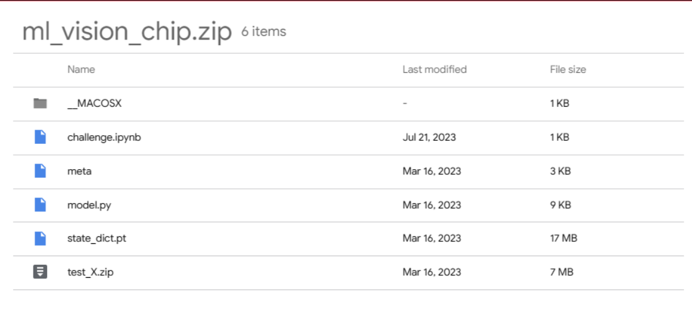
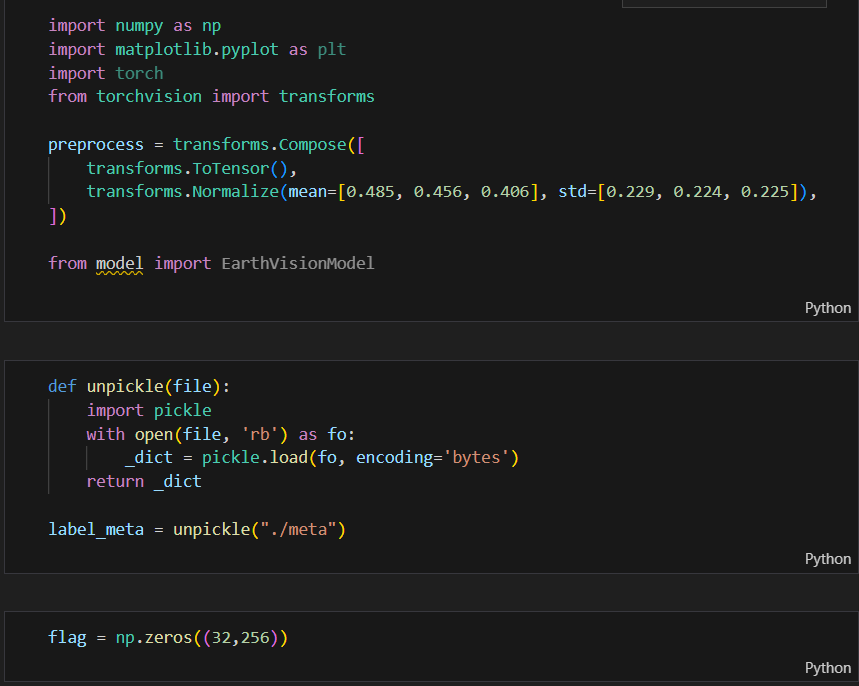
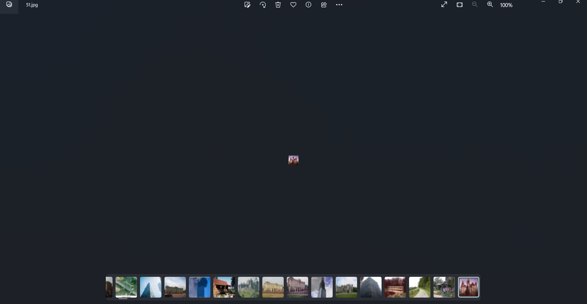
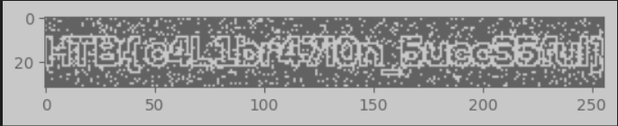

This is a challenge from my club's training session I solved in order to achieve a present and it is also my first AI-CTF related challenge out of those jailbreaking LLMs, here is my write up for it.

So, my teacher give us only a zip file called ```ml-visionchip``` and u can find it [here](https://drive.google.com/file/d/1L00FeNeuSsRz0Mb0tzCf2u3O1Aqy4qvg/view?usp=sharing)

So in the zip, we got sth like this: 




So first, we open the ```challenge.ipynb``` and we have:


It looks like it imports a model (maybe from ```model.py```) and then it reads a pickled file named ```meta```, deserializing it into a Python object, and storing that object in the variable ```label_meta```, after that, it shows that the flag is show by an array filled with zeros has the the shape of (32,256), indicating that it will have 32 rows and 256 columns.

Now we should have a look at the ```state_dict.pt``` file ( I still dont even know what it is, but it is said to store the states of the model). Then we should look at the ```test_X.zip```. Open it we would have a bunch of tiny photos showing of some places (notice that this is important for us). 


Finishing the looking part, now head to the part where we did it. Look at the pics above, they share the same thing that they are all huge man-made structure, and this reminds me about the ```label_meta```, let's have a look at it (I have done sth in order to make it understandble for us to read):
```
{b'fine_label_names': [b'apple', b'aquarium_fish',b'baby',b'bear',b'beaver' b'bed',b'bee',b'beetle',b'bicycle',b'bottle', b'bowl',b'boy',b'bridge', b'bus',b'butterfly',b'camel',b'can', b'castle',b'caterpillar','cattle',b'chair',b'chimpanzee',b'clock',b'cloud',b'cockroach', b'couch',b'crab', b'crocodile', b'cup', b'dinosaur',b'dolphin',b'elephant',b'flatfish',b'forest',b'fox', b'girl',b'hamster',b'house', b'kangaroo',b'keyboard',b'lamp', b'lawn_mower', b'leopard',b'lion', b'lizard',b'lobster',b'man',b'maple_tree',b'motorcycle',b'mountain',b'mouse', b'mushroom', b'oak_tree',b'orange', b'orchid',b'otter','palm_tree',b'pear',b'pickup_truck', b'pine_tree', b'plain', b'plate', b'poppy',b'porcupine',b'possum',b'rabbit',b'raccoon',b'ray', b'road',b'rocket', b'rose', b'sea',b'seal', b'shark', b'shrew',b'skunk', b'skyscraper',b'snail',b'snake',b'spider', b'squirrel',b'streetcar', b'sunflower',b'sweet_pepper',b'table', b'tank',b'telephone',b'television', b'tiger', b'tractor', b'train', b'trout', b'tulip', b'turtle',b'wardrobe',b'whale', b'willow_tree',b'wolf', b'woman', b'worm'],
 
 b'coarse_label_names': [b'aquatic_mammals',b'fish',b'flowers',b'food_containers', b'fruit_and_vegetables', b'large_carnivores',b'household_electrical_devices',b'household_furniture',b'insects', 
  b'large_man-made_outdoor_things',
  b'large_natural_outdoor_scenes', b'large_omnivores_and_herbivores', b'medium_mammals' b'non-insect_invertebrates',b'people','reptiles',b'small_mammals',b'trees', b'vehicles_1', b'vehicles_2'],
 
 b'label_map':{
  b'aquatic_mammals': [b'beaver',b'dolphin', b'otter',b'seal',b'whale'],
  
  b'fish': [b'aquarium_fish', b'flatfish', b'ray', b'shark', b'trout'],
  
  b'flowers': [b'orchid', b'poppy', b'rose', b'sunflower', b'tulip'],
  
  b'food_containers': [b'bottle', b'bowl', b'can', b'cup', b'plate'],
  
  b'fruit_and_vegetables': [b'apple',b'mushroom', b'orange',b'pear', b'sweet_pepper'],

  b'household_electrical_devices': [b'clock',b'keyboard',b'lamp',b'telephone', b'television'],

  b'household_furniture': [b'bed', b'chair', b'couch', b'table', b'wardrobe'],

  b'insects': [b'bee', b'beetle', b'butterfly', b'caterpillar', b'cockroach'],

  b'large_carnivores': [b'bear', b'leopard', b'lion', b'tiger', b'wolf'],

  b'large_man-made_outdoor_things': [b'bridge',
   b'castle',
   b'house',
   b'road',
   b'skyscraper'],

  b'large_natural_outdoor_scenes': [b'cloud',b'forest',b'mountain',b'plain',b'sea'],

  b'large_omnivores_and_herbivores': [b'camel', b'cattle',b'chimpanzee',b'elephant',b'kangaroo'],

  b'medium_mammals': [b'fox', b'porcupine', b'possum', b'raccoon',b'skunk'],
  
  b'non-insect_invertebrates': [b'crab', b'lobster', b'snail',b'spider',b'worm'],
  
  b'people': [b'baby', b'boy', b'girl', b'man', b'woman'],
  
  b'reptiles': [b'crocodile', b'dinosaur', b'lizard', b'snake', b'turtle'],
  
  b'small_mammals': [b'hamster', b'mouse', b'rabbit', b'shrew',b'squirrel'],
 
  b'trees': [b'maple_tree', b'oak_tree',b'palm_tree', b'pine_tree', b'willow_tree'],

  b'vehicles_1': [b'bicycle',b'bus',b'motorcycle',b'pickup_truck',b'train'],
  
  b'vehicles_2': [b'lawn_mower',b'rocket',b'streetcar',b'tank',b'tractor']}}
```

We can see that we have 3 groups in the ```label_meta```: fine_label_names, coarse_label_names and label_map. The ```coarse``` consists part of the ```fine``` and the map shows the both of them standing together. Haha, now we see that there is ```large_man-made_outdoor_things``` which related to those tiny pics we have above. So till now, we know that the model (which is MobileNetV2, which is often used for image classification, object detection, and semantic segmentation on mobile and edge devices) will do something, in order to evaluate the connection between ```label_meta``` and ```test_X```, so just write a short script to show what we have done:

```python
from tqdm import tqdm # this is a library for a progress bar
from natsort import natsorted
import os
from PIL import Image

model.load_state_dict(torch.load(f'state_dict.pt')) # loads the state dictionary of a PyTorch model from a file named 'state_dict.pt'.
model.eval() # sets the model to evaluation mode, which disables dropout and batch normalization layers, ensuring consistent inference results.

# getting meta data
label_names = [a.decode() for a in label_meta [b'fine_label_names']]
things = [a.decode() for a in label_meta [b'label_map'][b'large_man-made_outdoor_things']]

# Load all image paths in test_dir folder
test_dir= f'test_X' # unzip before running
img_paths = [os. path.join(test_dir, f) for f in natsorted (os. listdir(test_dir))]
transform = transforms. ToTensor()

result = []

# Loop over the image paths and load each image
for path in tqdm (img_paths):
    img= Image.open(path)
    image = preprocess (img). unsqueeze (0)
    index = int(model(image).argmax())
    r = 0 if label_names [index] in things else 1
    result.append(r)
```
Then it is clear now, we will try to mapping the image with the label, or labelling for clarify, and then showing the result under numpy array.

```python
from matplotlib import pyplot as plt 
plt.imshow(np.array(result).reshape((32, 256)), cmap="gray")
plt.show()
```
And we got: 


To me, it is such a good challenge for beginners cuz it teaches us some good points in image classification and some basic neccessary libraries. The above is my way in order to do this and i dont know if it is intended or not, if u have some other ways, feel free to text me. Thanks for reading!